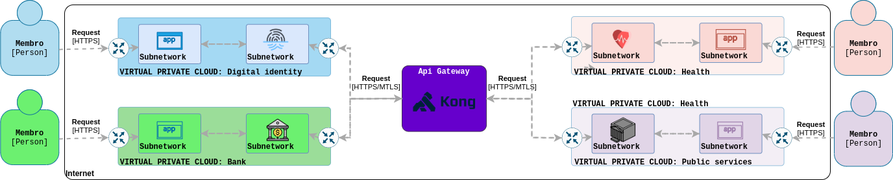

# Digital ecosystem

Um ecossistema digital formado por membros que podem ser pessoas representadas e acessando o mesmo através de sua identidade digital, até diversos serviços e softwares terceiros que para confiáveis cumprem o contrato e seguem o protocolo exigido por um gateway, que conecta todos membros e aplica as regras do ecossistema e assegura a interação e cooperação entre ele através de sua mediação.

---

## Finalidade
O projeto tem como objetivo a sua utilização como trabalho de conclusão de curso e laboratório de estudo e aprendizado, mas aberto a gerar outros resultados como consequência. 

### Tema
O trabalho tem como essencia resolver um problema mesmo que ficticio utilizando tecnologia, aplicando um processo de engenharia de software a fim obter uma solução que venha a demonstrar valor no contexto onde foi aplicada e principalmente aprender.

### Agradecimentos
Agradecimentos e referência ao orientador e mentor do trabalho [Gilvani Alves](https://www.linkedin.com/in/gilvani-alves-32754342/), especialista em redes de computadores e teleprocessamento e mestre em engenharia elétrica.

---

## Contexto e problema
O grupo  trabalha em função de diversos setores como bancário, saúde, serviços públicos e vários outros, formado por várias organizações separadas e independentes, sendo cada uma responsável por um setor, onde cada uma tem sua própria área de tecnologia, desenvolvimento e inovação, onde desenvolve, mantém, evolui, operacionaliza e prove sua correspondente solução para seu setor a fim de  realizar inovações e transformações digitais, gerando mais valor através de seus serviços.

Apesar dos resultados alcançados por cada setor individualmente, existem limites a serem superados, passando a pensar como um todo, tendo a necessidade de conectar as soluções mesmo não fazendo parte da mesma infraestrutura, mas não somente com as que fazem parte do grupo , também de terceiros considerados confiáveis, objetivando gerar mais valor aos usuários que são em comum entre a maioria das soluções, com a cooperação das soluções a fim de compartilhar dados e suas operações, aperfeiçoando e criando novos resultados.

Tendo como os principais problemas:

- Dos usuários:
    - Utilizam em comum praticamente as mesmas soluções.
    - Dados, definições e operações ficam repetidos entre as soluções utilizadas em comum.
    - Falta de um canal focal referente ao usuário nas demais soluções usadas.
- Das múltiplas soluções de diferentes setores, infraestruturas, posse e de até terceiros: 
    - Tem em comum praticamente os mesmos usuários.
    - Compartilham dados parecidos.
    - Necessitam interoperar para desburocratização e aumento da eficiência dos processos e criação de novos.
    - Restrição de continuarem separadas e sendo servidas como soluções separadas.
    - Dinamicidade da entrada e saída de novas soluções.

Junto com esse contexto vem diversos desafios a serem lidados:

  - Conformidade com a Lei Geral de Proteção de Dados Pessoais (LGPD).
  - Gerenciar e aplicar controles em comum e individual a todas soluções, mesmo não estando na mesma infraestrutura ou posse e até mesmo terceiros.
  - Garantir a segurança entre todos que estão conectados.
  - Observar, rastrear, integridade e confiabilidade dentro das interações.
  - Restringir apenas a membros, que para isso se tornaram confiáveis.
  - Padronizar para conformidade e cooperação dos membros.
  - Lidar com a dinamicidade da disponibilidade dos serviços.
  - E outras

---

## Proposta de solução
A solução proposta é o que eu chamo de um ecossistema digital do grupo , abrangendo todos seus usuários, devidas organizações do grupo e suas soluções até terceiros.

Sendo esse ecossistema uma representação digital do grupo, onde todas soluções e terceiros estariam conectados através de um ponto centralizador e os usuários passariam ter uma identidade digital única compartilhada entre todos dentro desse ecossistema como um todo.

### Api gateway

Um api gateway que realizará o papel de ponte na interoperação entre os membros, sendo estes serviços confiáveis que para isso seguem o protocolo definido através da padronização do gateway, além de ser o único autorizado a interagir com as demais soluções.

Com o api gateway conseguimos centralizar, aplicar e atuar na interação entre os serviços, pois tudo que envolver o ecossistema terá que passar pelo gateway, aplicando as regras necessárias toda vez, seja elas em comum ou específica a uma interação, existindo uma pessoa ou equipe em comum a todos responsável pelo gerenciamento e administração do gateway.

Isso é possível, pois o api gateway tem como features:
  
  - Somente o gateway
  - Controle da interoperação, declarando o que cada serviço pode fazer a partir do gateway.
  - Segurança com autenticação e autorização dos serviços, restringir ips, validar a requisição, comunicação segura com tls e mutual tls.
  - Observabilidade e rastreamento das interações através de logging, monitoramento, correlacionamento e mais.
  - Descoberta de serviços com consul.
  - E muito mais das features essenciais e comuns a serem aplicadas em todo ecossistema, além de ser extensível por plugins, veja aqui em [features](https://github.com/Kong/kong#features).

Sendo nossa solução de api gateway escolhida o [Kong](https://github.com/Kong/kong), um api gateway open-source, cloud-native, extensível através de plugins, baseado no web server nginx e amplamente utilizado em startups, empresas globais e instituições governamentais.

Primeiramente para ser a solução do projeto, era necessário resolver os problemas base listados anteriormente, depois ser uma solução open-source, bem documentada, já madura, pronta para uso e sendo utilizada por várias outros players, uma forte equipe por trás e que ainda fosse moderna e continuamente evoluindo, não somente mantida.

Várias outras soluções foram avaliadas como um forte concorrente a escolha foi o [KrakenD](https://github.com/devopsfaith/krakend-ce), mas é stateless, não sendo o caso desse problema.

### Identidade digital

Para solucionar as dos usuários, teríamos um novo serviço, que será responsável pela identidade e onde os usuários vão gerenciar e controlar suas informações dentro do ecossistema.

Os usuários passariam a ter uma única identificação que o representaria para tudo dentro do limite desse ecossistema, mantendo assim uma conta para o ecossistema, não para cada solução, onde tudo estaria relacionado a essa identidade.

Além disso as informações referentes aos usuários estariam centralizadas em um único lugar, gerenciadas e controladas pelos seus próprios dono, determinando a finalidades dos mesmos, atualizando e etc.

As informações fruto da interação com outras soluções, tambem estariam centralizadas em unico ponto que seria da devia solução, porem gerenciada e controlada pelo seu dono, determinando a finalidades dos mesmos, atualizando e etc.

Assim os usuários terão uma identidade digital dentro desse ecossistema, onde o papel dela é representar o usuário no ecossistema como um todo, dando o devido controle e visibilidade dentro do ecossistema.

### Exemplo da solução
Um usuário deseja utilizar a solução X, para isso o mesmo cria sua identidade dentro do ecossistema, gerencia suas informações e aceita os termos necessários referente a solução que quer acessar em um único lugar.

Com a identidade criada dentro do ecossistema o usuário consegue acessar a solução X e a partir de sua identidade e devidas configurações do usuário, consegue realizar suas ações que podem envolver ou não autorização do usuário ou consumo de alguma informação do mesmo.

Mesmo que a solução X venha gerar algum dado ou informação relacionada ao usuário, ela se manteria apenas no porte do mesmo, mas sobre controle de seu dono que seria o usuário, gerenciando através sua identidade. 

Caso o usuário precise utilizar alguma outra solução, como ele já tem sua identidade dentro do ecossistema, apenas precisaria fazer as devidas configurações e avaliações das permissões e termos, além de que se as soluções precisarem interagirem para realizar uma ação, como compartilhar informações, estaria totalmente sobre o controle do usuário sobre o uso de seus dados através da sua identidade dentro do ecossistema.

### Observações complementares

#### Service mesh
Muitos poderiam questionar o porquê não utilizar uma abordagem com service mesh no lugar de um api gateway, pois o cenário envolve uma quantidade dinâmica de serviços independente da sua granularidade, a minha resposta é baseada no pouco que sei sobre service mesh no momento em que aqui escrevo, onde ele é para casos onde todos serviços são primários e de nosso controle, estando em um rede de infraestrutura nossa, formando a malha a partir disso, diferente do contexto do problema abordado, onde mesmo que pertencendo ao mesmo grupo, os serviços um para os outros são terceiros e externos, sendo de controle e posse de outros.

Mas como o api gateway estará na ponta e externo a todos membros, nada impediria que um dos membros utilizasse um service mesh internamente em sua arquitetura, pois um pode complementar o outro, pois resolvem problemas diferentes.

#### Implementação
A solução proposta pode ser suficiente para o início, podendo posteriormente ter novos requisitos e necessidades, ficando mais complexa, necessitando customizar ou até mesmo desenvolver uma solução própria de api gateway, mas isso é uma suposição caso o projeto deixasse de ser apenas um laboratório.

---

## Validação

### Estratégia 
A partir do escopo do trabalho a solução será uma prova de conceito, tendo conteúdo suficiente para o laboratório e entrega do trabalho. 

Para estratégia de validação, o ecossistema será montado, tendo o desenvolvimento dos quatro serviços que representaram as soluções e compor tudo com o api gateway, implantando o ecossistema em uma infraestrutura simulando o ambiente e contexto proposto neste trabalho e como seria na vida real, validando a solução nesse ambiente, verificando resolução dos problemas propostos anteriormente.

### Index de todos serviços
- [Digital identity](https://github.com/gmarcial)
- [Bank](https://github.com/gmarcial)
- [Health](https://github.com/gmarcial)
- [Public services](https://github.com/gmarcial)

---

## Inspiração
Estonia e sua sociedade digital com todo ecossitema da [e-estonia](https://e-estonia.com/).

---

## Evolução contínua

Estou aberto a feedback, discussões, trocar uma ideia, compartilhar, contribuições e tudo aquilo que venha agregar e contribuir para a evolução continua, abra uma [issue](https://github.com/gmarcial/digital-ecosystem/issues/new), ficarei feliz em ter a oportunidade de aprender mais.

Obrigado.