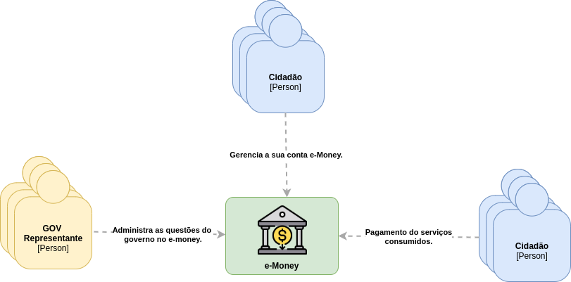

# e-Money

Um valor monetário representado através de créditos eletrônicos que tem finalidade servir de moeda apenas dentro de sua plataforma, onde é movimentado e utilizado para realização de pagamentos que deseje usufruir dentro da plataforma e-money.

A plataforma utiliza e-money em sua base ser um sistema de pagamentos em comum de serviços, produtos e etc de entidades que pertencem e participam da plataforma, sendo os usuários da plataforma consumindo os de dentro serviços da plataforma.

Ex: Pagar a passagem de ônibus.

Para estar disponível na plataforma, é preciso se integrar ao hub.

## Em desenvolvimento...

---

## Finalidade
O projeto tem como objetivo a sua utilização como trabalho de conclusão de curso e laboratório de estudo e aprendizado, mas aberto a gerar outros resultados como consequência. 

### Tema
O trabalho tem como essencia resolver um problema mesmo que ficticio utilizando tecnologia, aplicando um processo de engenharia de software a fim obter uma solução que venha a demonstrar valor no contexto onde foi aplicada e principalmente aprender.

### Agradecimentos
Agradecimentos e referência pelas orientações e mentoria: 
- [Gilvani Alves](https://www.linkedin.com/in/gilvani-alves-32754342/).
- [Henrique Ribeiro](https://linkedin.com/in/henriqueprj/).

### Observação
Por hora o projeto só vai contar com o desenvolvimento e entrega do backend, ficando aberto a possibilidade das demais partes como clientes mobile e web.

Quem tiver vontade e disposição de participar contribuindo com evolução do projeto para outros horizontes, seja na parte de frontend e outras demais possibilidades aqui não observadas, mesmo o projeto sendo sem a finalidade de venda e lucro, o aprendizado e experiência é objetivo.

Estou a disposição.

---

## Contexto e problema
O governo da Techlandia está com um projeto de sociedade digital em andamento, onde uma das partes desse projeto é a utilização de créditos eletrônicos como pagamento de serviços ofertados para a população. 

O governo é o ofertante desses serviços para a população, quem administra e controla os serviços ofertados, precisa estar no controle e gerenciamento da utilização desses créditos como um banco e os devidos repasses e negociações com os devidos serviços ofertados através desses créditos como uma adquirente. 

É preciso que o governo seja o ponto central em comum entre a população que irá adquirir créditos e consumir, e as entidades prestadoras desses serviços através do governo, que recebem e precisam se manter para isso, tendo em mente que as entidades e serviços que são ofertados são dinâmicos, podendo mudar conforme a necessidade.

Mesmo com o adiamento da LGDP, é uma restrição começar a aplicar medidas para estar no caminho da conformidade com a lei, principalmente por envolver diretamente dados pessoais.

Ficou a responsabilidade da ShinerayLab projetar e desenvolver uma solução isso.

### Features
- Abertura de conta.
- Login.
- Gerenciamento dos seus dados.
- Recarga de créditos e-money.
- Extrato das transações realizadas na conta.
- Troco fácil
- Comprovante das transações realizadas.
- Pagamento de serviços dentro da plataforma.
- Transferencia de credito entre contas da plataforma.
- Vinculação de novos serviços a plataforma.
- Autorização do uso de serviços dentro da plataforma.
- Contabilização do repasse para as entidades prestadoras de serviço.
- Encerrar conta.

---

## Proposta de solução
A solução é a plataforma e-money, consistindo da criação de uma moeda em comum para pagamento dos serviços, um hub para as entidades acordadas com o governo para oferecer serviços dentro da plataforma que sua forma de pagamento são os créditos eletrônicos e-money. 

O governo irá administrar os serviços disponíveis, onde são ofertados para a população através da e-money, repassando como pagamento dos serviços prestados para as entidades parceiras conforme acordado dos lucros dentro da plataforma com as compras dos créditos. 

Do outro a população realiza a abertura de sua conta na plataforma através de seu cpf e demais dados, comprando créditos do "governo" e podendo usufruir de qualquer serviço disponível da qual ela tenha autorizado, pois é uma moeda em comum que todos serviços aceitam, debitando direto de seu saldo. 

A conta da e-money pode ser encerrada a qualquer momento e tem características muito parecidas de uma conta bancária comum, porém sendo restrita a plataforma e não sendo dinheiro de verdade. 

Os dados e informações serão tratadas, armazenadas e manipuladas buscaram estar de acordo com a LGPD.

[Clique para ampliar e-Money para o nível 2](./docs/architecture/container/README.md)

---

## Validação

### Estratégia 
A partir do escopo do trabalho a solução será uma prova de conceito, tendo conteúdo suficiente para o laboratório e entrega do trabalho. 

Para estratégia de validação, a plataforma será desenvolvida e colocada em produção em algum ambiente, nesse ambiente será simulado todo ciclo, desde a vinculação de um serviço, cidadão abrindo sua conta, até pagando por um serviço com e-money.

Assim passando pelas principais features propostas, validando se o problema foi solucionado.

---

## Inspirações e referencias
- Estonia e sua sociedade digital com todo ecossitema da [e-estonia](https://e-estonia.com/).
- A solução [e-bank](https://e-estonia.com/solutions/business-and-finance/e-banking) e um dos seus meios de pegamentos o [e-money](https://www.eestipank.ee/en/payments/means-payments).

---

## Evolução contínua

Estou aberto a feedback, discussões, trocar uma ideia, compartilhar, contribuições e tudo aquilo que venha agregar e contribuir para a evolução continua, abra uma [issue](https://github.com/gmarcial/e-money/issues/new), ficarei feliz em ter a oportunidade de aprender mais.

Obrigado.