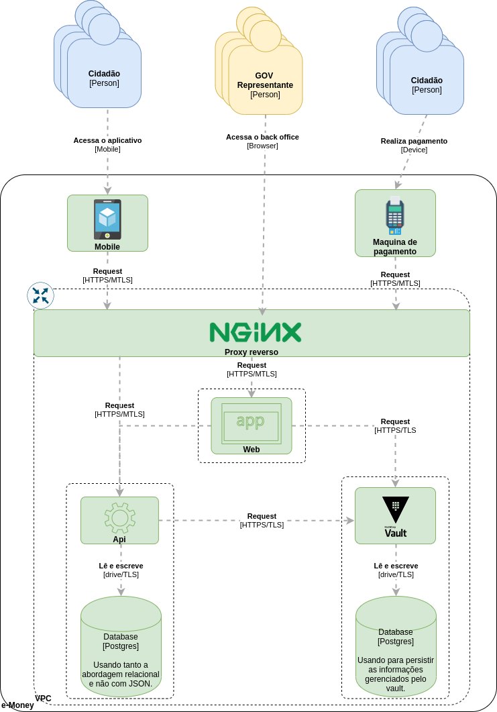

# Container

A arquitetura por parte dos clientes, inicialmente é composta somente por primários que farão o interfaceamento com os usuários finais, tendo cada um deles uma finalidade diferente, pois cada contexto tem suas necessidades, sendo web para o back office onde os administradores irão gerenciar a plataforma, já os cidadãos, utilizam as plataformas mobile para acesso e gerenciamento de sua conta e máquinas de pagamento para pagamento dos serviços.

Com objetivo de evitar acesso direto aos recursos, principalmente a api, a frente de todas requisições terá um proxy reverso que pela sua maturidade a escolha foi o nginx. Toda comunicação passará por ele, será o filtro inicial antes do redirecionamento, realizando alguns trabalhos gerais e genéricos em relação a requisição, intermediando entre os recursos internos e os requisitantes.

Uma das partes mais importantes é a api rest utilizando em seus contratos de comunicação o formato json, responsável pela operacionalização da plataforma, aplicando as regras de negócio.
Irá servir aos clientes, estará integrado ao vault para gerenciamento dos segredos que estarão envolvidos na infra e em algumas das regras de negócio, onde iremos nos aprofundar mais a frente em próximos artigos, e o banco de dados postgres para persistências das informações, tanto para a api, quanto ao vault, podendo adotar abordagens relacional e não relacional.

O projeto tem como premissa ser cloud native, que será optado entre a google cloud e a digital ocean, tendo como restrição o custo financeiro final, por se tratar de um projeto sem fins lucrativos e financiado por fundos pessoais.

Todo o projeto por questões de segurança estaria em uma VPC e sub-redes para não estarem expostos diretamente a internet, além de ter o proxy como um gateway, criando um ambiente seguro, gerenciado em várias etapas e claro em containers docker.

## Para mais informações, principalmente de cada parte separada da arquitetura, acesse o artigo com o tema em espefico, onde é aprofundado em detalhes: [Project e-Money: Arquitetura](https://dev.to/gmarcial/project-e-money-design-2c2c)